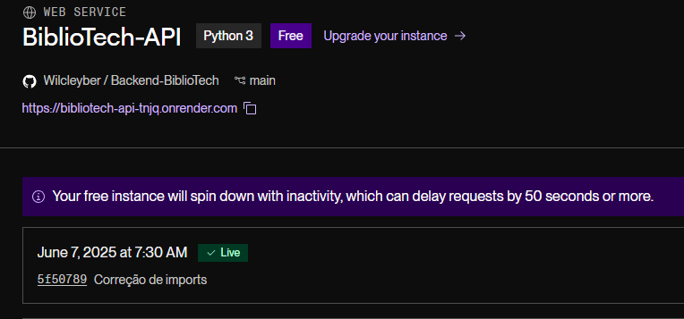
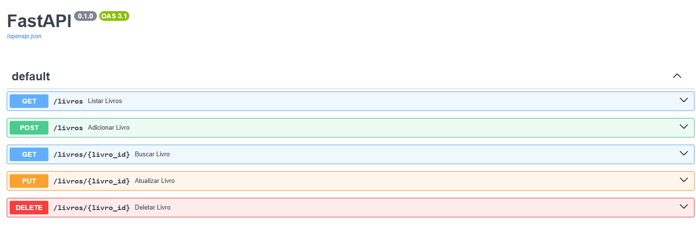

📚 BiblioTech - Backend API
The backend for the BiblioTech application, a book management system developed with FastAPI and PostgreSQL (originally with SQLite). The API is hosted online and ready to use!

🚀 Access the Online API
▶️ Interactive documentation via Swagger UI:
https://bibliotech-api-tnjq.onrender.com/docs

📦 Technologies
- FastAPI
- SQLAlchemy
- PostgreSQL
- Pydantic

Project for study and portfolio purposes. Feel free to contribute!